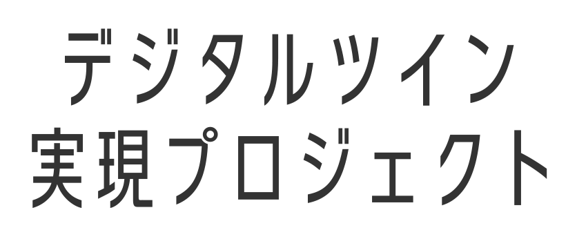

TerriaJS
============

 

こちらは、東京都デジタルツイン実現プロジェクトにおける「東京都デジタルツイン 3D ビューア」で実現した機能を含む、TerriaJS のパッケージです。TerriaJS は、地図アプリケーションのコアとなる JavaScript ライブラリです。TerriaJS の概要は、 [TerriaJS README](https://github.com/TerriaJS/TerriaJS) を参照ください。
 
 

### 東京都デジタルツイン実現プロジェクト

- 情報発信サイト 
  https://info.tokyo-digitaltwin.metro.tokyo.lg.jp/  
- 東京都デジタルツイン 3D ビューア 
  ※ 上記の情報発信サイトからリンクされております。 
  https://3dview.tokyo-digitaltwin.metro.tokyo.lg.jp/  
- [TerriaJsの公式ドキュメント](https://docs.terria.io/guide/)にはない東京都デジタルツイン3Dビューア独自の設定項目については、[こちら](./CUSTOM_FEATURES.md)を参照ください。

## 【 3Dビューア構築時の留意事項】
- 東京都デジタルツイン3Dビューアでは「高さ計測機能」をご利用いただけますが、本リポジトリをクローンして3Dビューアを構築し、　高さ計測機能を使用する場合は、Cesium ion SDKのライセンスが必要となります。
　Cesium ion SDK
　  https://cesium.com/platform/cesiumjs/ion-sdk/
- 高さ計測機能を利用する場合、 Cesium ion SDKのライセンスを準備し、SDKファイル（cesiumgs-ion-sdk-measurements-6.0.0.tgz）をダウンロードし、ダウンロードしたファイルを 「TerriaMap/packages/ 」配下に展開し、ご利用ください。